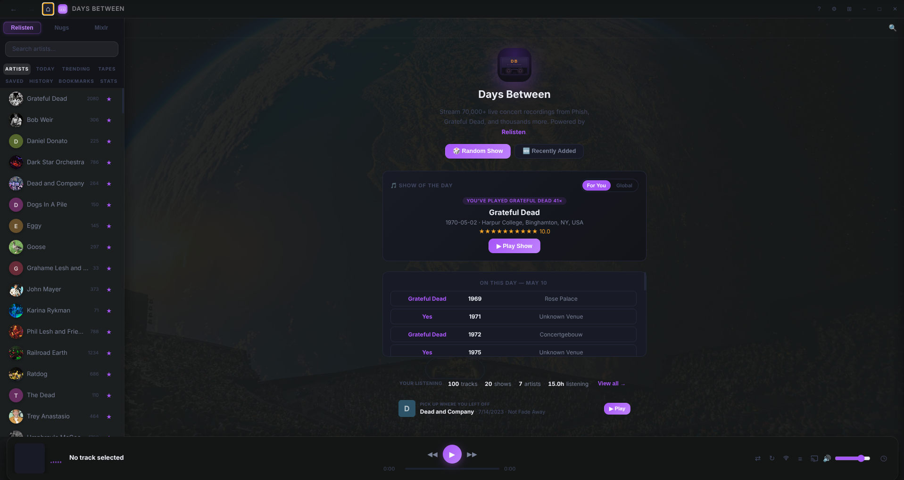
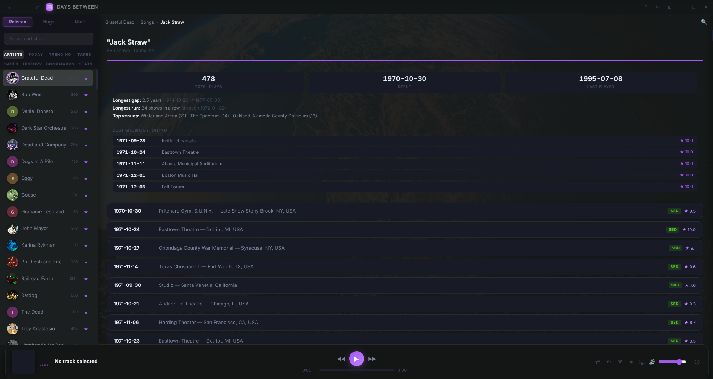
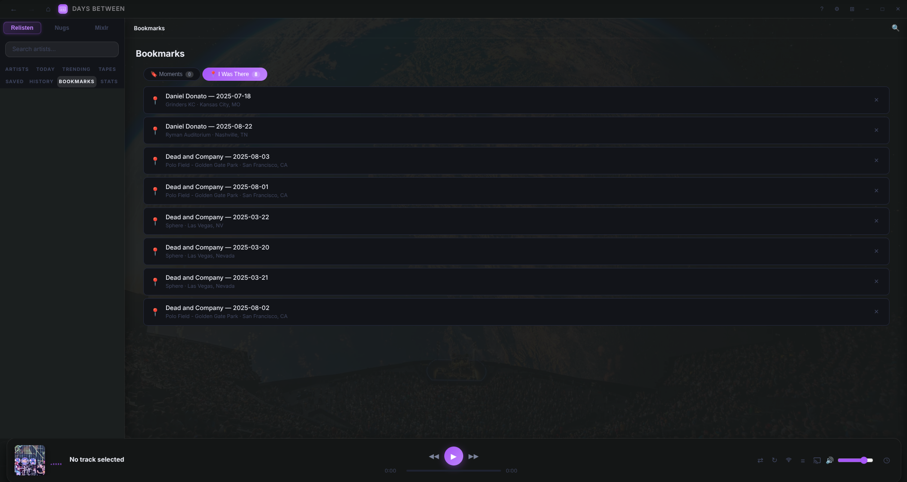
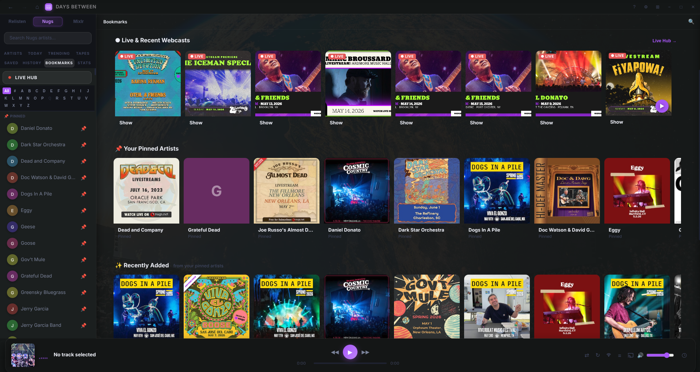
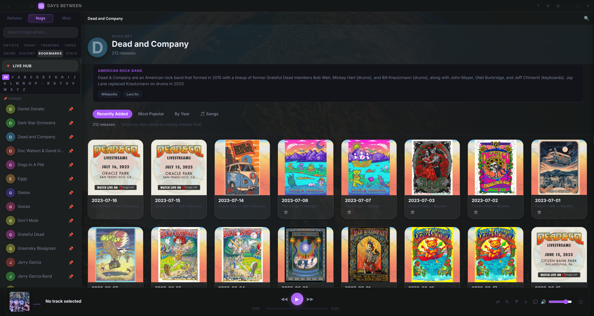
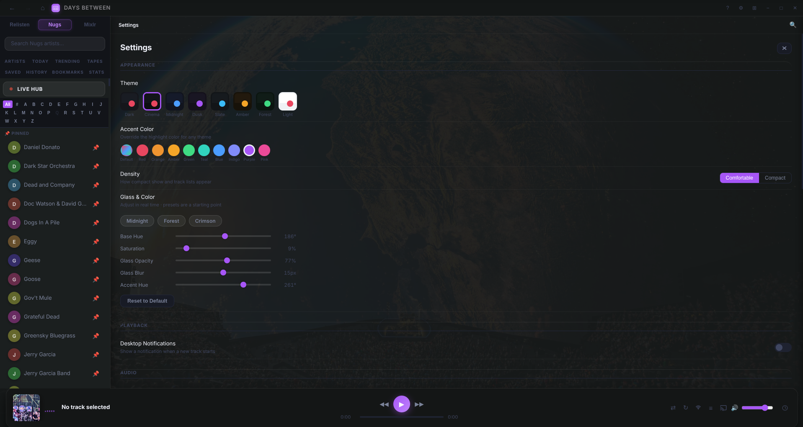

# Days Between

> A desktop client for live concert recordings — Relisten + Nugs.net + setlist.fm in one library that knows what you've heard and what you've been to.

Days Between is built for jam-band tape traders. It combines Relisten's free 70,000-show archive, Nugs.net's subscription audio &amp; video, and live Mixlr webcasts under one Glass UI. Every artist page knows which shows you attended, which songs you've actually heard live, and which you've just played a lot of. Every song has authoritative play counts pulled live from setlist.fm — the same number a deadhead would quote you at a show.

No telemetry, no accounts, no cloud sync. All your data lives on your machine.



---

## Why Days Between

Most Relisten clients show you the catalog. Days Between layers on **Setlist Intelligence** — the personal-history infrastructure that turns a passive browser into a tool that knows your relationship with this music.

- **Authoritative per-song play counts.** When you click "Bertha" on a Dead artist page, the app queries setlist.fm and shows you the real number — 77+ plays, not the 25 that Relisten happens to have recordings for. Live progress while it scans, then cached for 7 days. Works offline once cached.
  

- **"I Was There" library.** Mark any show — Relisten or Nugs — as attended. The app remembers, surfaces those shows back to you with a 🎧 indicator on every song you've heard live, and feeds the personalization engine.
  

- **Personalized Show of the Day.** Welcome page picks a daily show tailored to artists you actually care about — blending attendance, listening history, and pinned artists into a single affinity score. A `[For You / Global]` toggle lets you switch back to the global trending pick anytime, and a small accent chip tells you why each show was chosen.

- **Multi-source streaming, one sidebar.** Relisten / Nugs / Mixlr live as source tabs in the same sidebar. Search spans all three. "I Was There" entries from any source open in the right viewer (Nugs ones get a small `nugs` badge). The Nugs welcome page surfaces live webcasts, your pinned artists, and recently-added catalog releases — all album-cover-driven.
  
  Per-artist pages mirror the Relisten layout — Recently Added / Most Popular / By Year / 🎵 Songs tabs, album-cover grid, and the same per-song stats you get on the Relisten side.
  

- **Five-band parametric EQ + Chromecast + Last.fm scrobbling + local archival downloads.** The streaming basics covered well, not bolted on.

---

## Download

Grab the latest installer from the [**Releases page**](https://github.com/DeceasedCranium/days-between/releases/latest) — no account required.

| Platform | File | How to install |
|---|---|---|
| **Linux** (any distro) | `.AppImage` | `chmod +x` then double-click — single file, no install |
| **Linux** (Debian / Ubuntu) | `.deb` | `sudo dpkg -i Days-Between-*.deb` |
| **macOS** (Apple Silicon) | `.dmg` | Open, drag to Applications. App is **unsigned** — right-click → Open → Open the first time to bypass Gatekeeper. |
| **Windows** | `.exe` (installer) or `.exe` (portable) | Run the installer. SmartScreen will warn — click "More info" → "Run anyway". |

The installers bundle their own Electron — no system dependencies.

---

## Features

**Playback** — gapless dual-buffer audio, HLS streaming via hls.js, 5-band parametric EQ with bypass and presets, Chromecast (audio + video), inline HLS video player for Nugs livestreams.

**Browse** — Relisten's full catalog with year / decade / venue / song / tour grouping. Nugs artist pages with Recently Added / Most Popular / By Year / 🎵 Songs tabs. Live Mixlr webcasts. Cross-source global search.

**Discover** — Show of the Day (For You / Global), On This Day, Trending, Recent, Random Show, Artist Radio (auto-queues related artists from Last.fm), per-song debut / last-played / longest-gap statistics.

**Personal library** — saved shows, attended shows ("I Was There"), playback history (1000-track ring buffer), tapes (custom playlists), 1–5 ratings, per-show notes. Listening-stats strip + "pick up where you left off" resume card on the welcome page. Last.fm scrobbling.

**Local archival** — ⬇ Download Show button on any release saves the full setlist plus cover art to `~/Music/Days Between/<Artist>/<Date - Venue>/`. Sequential downloads with human-cadence delays, persistent progress pill, and (for Nugs) auto-pause/resume of live playback to respect single-active-stream limits.

**Interface** — Glass UI with backdrop-filter blur, 8 themes (Dark / Cinema / Midnight / Dusk / Slate / Amber / Forest / Light), 10 accent colours, Comfortable / Compact density toggle, mini-player mode, Now Playing overlay with full setlist, queue panel with shuffle / repeat. Inter font bundled — works fully offline.



---

## Setup from source

```bash
git clone https://github.com/DeceasedCranium/days-between.git
cd days-between
npm install

# Optional — needed for Last.fm scrobbling, Artist Radio, Wikipedia
# artist images, and setlist.fm authoritative play counts. The app
# boots fine without it; those features just stay dormant.
cp config.example.js config.js
# Then edit config.js and add your API keys (links inside the file).

npm start
```

Requires Node 22+. The Electron binary that `npm install` pulls is bundled — no system Electron needed.

To build distributable installers for your platform:

```bash
npm run dist
# Output: dist/  (DMG / EXE / AppImage+deb depending on host OS)
```

### Configure third-party services

| Service | What it does | Required? | Get a key |
|---|---|---|---|
| **[Last.fm](https://www.last.fm/api/account/create)** | Scrobbling, Artist Radio, Wikipedia/Last.fm artist images | Optional | Free, instant |
| **[setlist.fm](https://api.setlist.fm/docs/1.0/index.html)** | Authoritative per-song play counts | Optional | Free, ~24h email approval |
| **[nugs.net](https://nugs.net)** | Subscription audio &amp; video catalog | Optional | Sign in via Settings, paid subscription |

If `config.js` is missing or empty, the app reports the dependent feature as unavailable rather than half-failing. You can add keys at any time and restart.

---

## Keyboard Shortcuts

| Key | Action |
|---|---|
| `Space` | Play / Pause |
| `[` / `]` | Previous / Next track |
| `← / →` | Seek back / forward 15 s |
| `Shift ← / →` | Seek back / forward 60 s |
| `↑ / ↓` | Volume up / down |
| `S` | Toggle shuffle |
| `R` | Cycle repeat (off → one → all) |
| `Ctrl+E` | Toggle EQ bypass |
| `Alt ← / →` | Navigate back / forward |
| `/` | Global search |
| `Q` | Toggle queue panel |
| `M` | Mini player |
| `?` | Help / shortcuts reference |
| `Esc` | Close any overlay |

---

## Data &amp; Privacy

All user data is local — nothing leaves your machine without your action.

| Data | Storage |
|---|---|
| Listening history, saved shows, tapes, notes, ratings, attended shows | IndexedDB (via localforage) |
| Settings (theme, accent, EQ bands, density…) | IndexedDB |
| Last.fm session token | IndexedDB |
| Nugs.net session token | IndexedDB |
| Wikipedia / Last.fm artist-image cache (30-day TTL) | localStorage |
| setlist.fm song-count cache (7-day TTL) | IndexedDB |

The only outbound network calls are to:
- the streaming source the user just clicked on (Relisten / Nugs / Mixlr / Akamai CDN)
- `api.last.fm` if a Last.fm session is connected
- `api.setlist.fm` when a song-detail page is opened
- `api.github.com` once at launch (update notifier; one request, no auth)

No telemetry. No accounts. No cloud sync.

---

## Architecture

See [`ARCHITECTURE.md`](./ARCHITECTURE.md) for the full process model, trust boundaries, storage layer, audio engine notes, and a step-by-step "how to add a feature" guide.

Short version: Electron main process owns filesystem / OS / Cast / MPRIS / signing secrets; renderer is sandboxed Chromium with native ES modules and no `require`. A pure-helper module (`app/shared/helpers.js`) is browser-free and unit-tested via `node:test` — CI runs the suite before any build job ships, so regression-prone catalog/parsing logic can't ship broken.

---

## Version History

See [`CHANGELOG.md`](./CHANGELOG.md) for the full per-release log going back to v1.0. Recent highlights:

- **v2.2.3** — Delta-audit fixes. "Play Best Recording" now agrees with the source picker (was picking Matrix when picker showed AUD). setlist.fm cache no longer locks on empty-data states. Advanced Search artist switcher has a supersede guard against rapid pick races. Nugs catalog fetch dedupes in-flight requests.
- **v2.2.2** — Configurable downloads folder in Settings → Data (default stays `~/Music/Days Between/`; users can pick any folder via native picker, with ↗ Open reveal-in-file-manager button and Reset). Source-switch no longer auto-pauses playback — browsing source metadata mid-show no longer interrupts what you're listening to.
- **v2.2.1** — Nugs sign-in error handling. Specific error messages (bad creds vs. captcha vs. network vs. Cloudflare-challenge) instead of one catch-all. Fixed a latent `parseNugsDate` ReferenceError that only fired on fresh Nugs sign-in — caught by a Reddit bug report (thanks OddKey2242).
- **v2.2.0** — Setlist Intelligence II. Source picker rebuilt with colour-coded SBD/AUD/MTX/FM badges, taper credits, BEST pill, and a clickable archive.org link in the metadata block. New "Prefer Soundboard" setting in Settings. **JerryBase-style Advanced Search** — filter by date / venue / tour / day-of-week, add multiple song-position rows with segue support, typeahead autocomplete on every field, dual `▶ Relisten` and `🎤 Nugs` action buttons per result. setlist.fm API hardening — Accept-Language fix, slower rate limit, and a one-time cache migration that silently upgrades v2.0/v2.1 caches. 48 new unit tests (130 total).
- **v2.0.0** — Distribution release. Polish + stability + identity pass: storage-bug audit, sidebar layout fix, debug-gated console, friendly error messages, About panel, first-run experience, README + screenshots, AppImage as primary Linux artifact, real installers across macOS / Linux / Windows. No new user-facing features beyond what shipped in v1.x — this is the "ready to share with friends" milestone.
- **v1.14.0** — Personalized Show of the Day with For You / Global toggle and reason chips.
- **v1.13.0** — setlist.fm live integration: authoritative per-song play counts.
- **v1.12.0** — Setlist Intelligence kickoff: Songs tabs, attendance tracking, title dedup.
- **v1.11.0** — Quality pass: pure helpers, 42 unit tests, CI gate.
- **v1.10.0** — Welcome polish, in-app update notifier, listening stats, global accent fix.

---

## Credits

- **[Relisten](https://github.com/RelistenNet/relisten-web)** — the open API powering all Relisten content
- **[Nugs.net](https://nugs.net)** — official source for subscription streaming
- **[setlist.fm](https://www.setlist.fm)** — community-curated setlist database
- **[Last.fm](https://www.last.fm)** + **[Wikipedia](https://www.wikipedia.org)** — artist images, biographies, scrobbling
- **[hls.js](https://github.com/video-dev/hls.js)** — HLS streaming (Apache 2.0)
- **[localforage](https://github.com/localForage/localForage)** — IndexedDB wrapper (Apache 2.0)
- **[castv2-client](https://github.com/thibauts/node-castv2-client)** — Chromecast protocol (MIT)
- **[Inter](https://rsms.me/inter/)** — typeface (SIL Open Font License)

---

## Disclaimer

This is an independent personal-use desktop client. It is **not affiliated with, endorsed by, or connected to** Relisten, Nugs.net, or setlist.fm.

- **Nugs.net content** is only accessible to users with an active Nugs.net subscription. The app authenticates using your own credentials and does not bypass, circumvent, or share any paywall.
- **Relisten content** is served via the public Relisten API and is freely available per that project's terms.
- All streams are fetched live from the providers' own CDNs.
- The optional **Local archival** feature saves files to your own machine for personal offline listening only — it does not redistribute, share, or upload anything. Relisten recordings are taper/community sourced and freely distributable per the Relisten terms; Nugs.net downloads remain bound by your subscription's terms of use.

Use of this software is solely your responsibility. Review each service's terms before use.

## License

MIT
