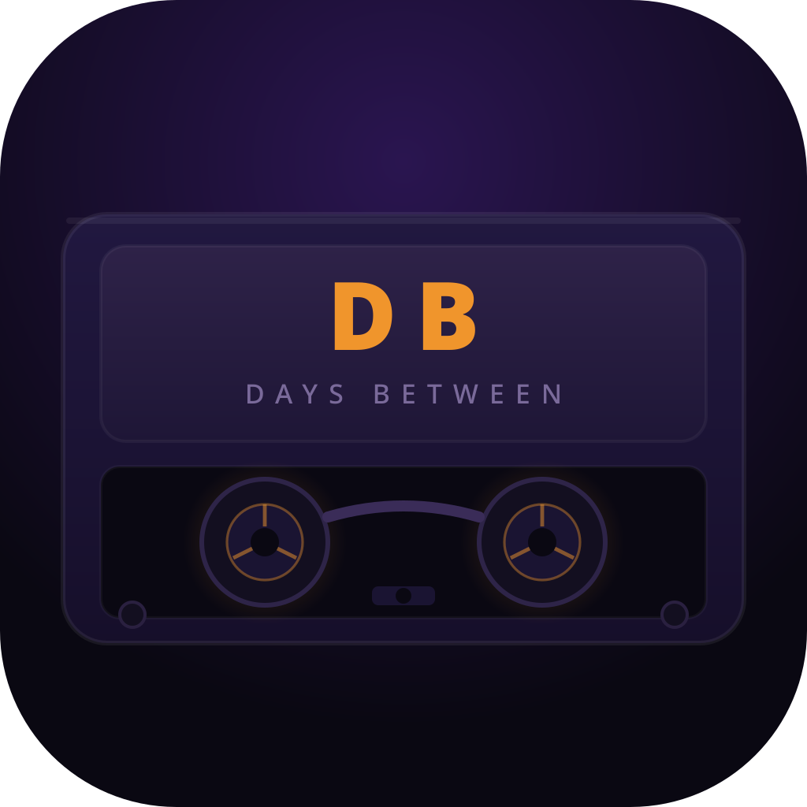

# Days Between

A desktop app for streaming live concert recordings from [Relisten](https://relisten.net) and [nugs.net](https://nugs.net) — 70,000+ shows from Grateful Dead, Phish, and hundreds more.

Built with Electron, no bundler. All your data stays local on your machine.



---

## Download

Pre-built installers are produced automatically by GitHub Actions on every push to `main`.

1. Go to the [**Actions** tab](https://github.com/DeceasedCranium/days-between/actions)
2. Open the latest **Build & Package** run
3. Scroll to **Artifacts** and download the package for your platform:

| Platform | File | Notes |
|----------|------|-------|
| macOS | `dist-mac` → `.dmg` | Open DMG, drag to Applications |
| Windows | `dist-windows` → `.exe` | Run the NSIS installer or use the portable EXE |
| Linux | `dist-linux` → `.AppImage` / `.deb` | `chmod +x` the AppImage, or `dpkg -i` the deb |

> **No Electron installation required** — the installers bundle everything.

---

## Features

### Playback
- **Relisten + nugs.net** — Browse and stream HLS and direct MP3/FLAC recordings
- **Gapless playback** — Dual-buffer crossfade engine swaps audio elements seamlessly between tracks
- **5-band graphic EQ** — Boost or cut 60 Hz, 250 Hz, 1 kHz, 4 kHz, 12 kHz; bypass toggle; settings persisted across sessions
- **Chromecast** — Cast audio and video to any Cast device on your network
- **HLS streaming** — via hls.js with automatic fallback

### Discovery
- **Artist / Year / Show / Track** browsing with full-text search
- **On This Day** — every show played on today's date, any year
- **Trending & Recent** — community-popular shows surfaced from the Relisten API
- **Artist Radio** — auto-queues related artists when your queue ends
- **Decades view** — browse by era (60s, 70s, 80s…)

### Personal Library
- **Saved shows** — heart any show to bookmark it
- **Listening history** — every track you've played
- **Tapes** — custom playlists you build manually
- **Stats** — plays, artists, hours listened
- **Last.fm scrobbling** — connect your account in Settings

### Interface
- **Glass UI** — frosted-glass sidebar, titlebar, and floating player bar with backdrop-filter blur; transparent Electron window for native compositor integration
- **8 themes** — Dark, Cinema, Midnight, Dusk, Slate, Amber, Forest, Light
- **Accent colours** — 10 presets that override any theme's highlight colour
- **Comfortable / Compact density** — toggle in Settings
- **Mini player** — compact always-on-top mode pinned near the system tray
- **Now Playing overlay** — full setlist with song times
- **Queue panel** — reorder, shuffle, repeat

---

## Requirements

**Pre-built installers** — no extra dependencies. Download from the [Actions tab](https://github.com/DeceasedCranium/days-between/actions) and run the installer for your platform.

**Running from source** requires:
- [Node.js](https://nodejs.org/) 18+
- [Electron](https://www.electronjs.org/) 39+ (uses native ES modules — no bundler step)
- On Arch / CachyOS: `sudo pacman -S electron39`

---

## Setup

### From source (development)

```bash
git clone https://github.com/DeceasedCranium/days-between.git
cd days-between
npm install

# Optional — needed for Last.fm scrobbling and Artist Radio
cp config.example.js config.js
# Edit config.js and add your Last.fm API key
# Free key at https://www.last.fm/api/account/create

electron39 .
```

### Build installers locally

```bash
npm run dist
# Output: dist/  (DMG / EXE / AppImage+deb depending on your platform)
```

### Last.fm

Scrobbling and Artist Radio require a Last.fm API key. Get one free at [last.fm/api/account/create](https://www.last.fm/api/account/create) and add it to `config.js`. The app works without it — only these two features are disabled.

### nugs.net

Requires an active nugs.net subscription. Sign in from **Settings → Nugs.net**. The app authenticates with your own credentials and does not store or share your password beyond the session token.

---

## Keyboard Shortcuts

| Key | Action |
|-----|--------|
| `Space` | Play / Pause |
| `[ / ]` | Previous / Next track |
| `← / →` | Seek back / forward 15 s |
| `Shift ← / →` | Seek back / forward 60 s |
| `↑ / ↓` | Volume up / down |
| `S` | Toggle shuffle |
| `R` | Cycle repeat (off → one → all) |
| `Ctrl+E` | Toggle EQ bypass |
| `Alt ← / →` | Navigate back / forward |
| `/` | Global search |
| `Q` | Toggle queue |
| `M` | Mini player |
| `?` | Keyboard shortcuts reference |
| `Esc` | Close overlay |

---

## Data & Privacy

All user data is stored locally — nothing leaves your machine:

| Data | Storage |
|------|---------|
| Listening history, saved shows, tapes, notes | IndexedDB (via localforage) |
| Settings (theme, EQ bands, density…) | IndexedDB (via localforage) |
| Last.fm session token | IndexedDB (via localforage) |
| nugs.net session token | IndexedDB (via localforage) |

Legacy data from `localStorage` is automatically migrated to IndexedDB on first launch of v1.1+.

No telemetry, no accounts, no cloud sync.

---

## Architecture Notes

- **Native ES modules** — no webpack/vite; Electron loads `app.js` as `type="module"` directly
- **Audio engine** (`audio-engine.js`) — dual-buffer gapless with element-swap crossfade; event-routing proxy so listener bindings survive primary/staging swaps
- **EQ engine** (`eq-engine.js`) — singleton `AudioContext`; both audio elements permanently connected to the same 5-node peaking BiquadFilter chain; virtual bypass (gains → 0 dB, nodes stay connected)
- **Storage** (`state.js`) — in-memory cache with synchronous reads; async writes fire-and-forget to IndexedDB; v1.0 → v1.1 migration runs once on `loadAll()`
- **XSS hardening** — all template strings go through `safeInnerHTML()` (strips `on*` attributes and `javascript:` hrefs); dynamic user content always wrapped in `esc()`
- **CORS** — `crossorigin="anonymous"` on both `<audio>` elements; main-process `onHeadersReceived` injects `Access-Control-Allow-Origin: *` for archive.org audio and nugs image CDN

---

## Version History

| Version | Highlights |
|---------|-----------|
| **v1.4** | Glass UI — transparent window, backdrop-filter blur on sidebar/titlebar/player, Inter typography, floating player bar, 20px-radius cards, CSS enter animation on view swap |
| **v1.3** | 5-band graphic EQ with IndexedDB persistence and `Ctrl+E` bypass shortcut |
| **v1.2** | Gapless playback via dual-buffer audio engine with 0.4 s element-level crossfade |
| **v1.1** | Storage migrated from `localStorage` to IndexedDB via localforage |
| **v1.0** | Initial release — Relisten + nugs streaming, Chromecast, Last.fm, themes |

---

## Credits

- **[Relisten](https://github.com/RelistenNet/relisten-web)** — open API powering all Relisten content
- **[nugs.net](https://nugs.net)** — official source for nugs streaming content
- **[hls.js](https://github.com/video-dev/hls.js)** — HLS streaming (Apache 2.0)
- **[localforage](https://github.com/localForage/localForage)** — IndexedDB wrapper (Apache 2.0)
- **[castv2-client](https://github.com/thibauts/node-castv2-client)** — Chromecast protocol (MIT)

---

## Disclaimer & Educational Use

This is a personal portfolio project built to learn Electron, HLS streaming, Web Audio API, and browser security techniques (Content Security Policy, ES module architecture, XSS mitigation). It is not affiliated with, endorsed by, or connected to Nugs.net or Relisten.

- **Nugs.net content** is only accessible to users with an active nugs.net subscription. This app authenticates using your own credentials and does not bypass, circumvent, or share any paywall.
- **Relisten content** is served via the public Relisten API and is freely available per that project's terms.
- This app does not redistribute, download, or cache any copyrighted audio or video. All streams are fetched live from the providers' own CDNs.

Use of this software is solely your responsibility. Review each service's terms before use.

## License

MIT
